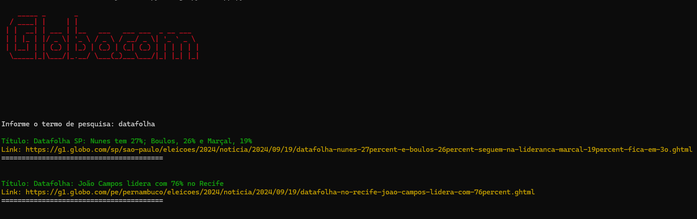

# News Scraper - Globo.com

Este é um projeto de Web Scraping desenvolvido em Python, que utiliza as bibliotecas `requests`, `BeautifulSoup`, e `colorama` para buscar e exibir notícias com base em um termo de pesquisa fornecido pelo usuário. O design do console é estilizado com cores para melhorar a legibilidade.

---

  

---

## Funcionalidades

- Realiza scraping na página principal da Globo.com para buscar notícias com base em um termo.
- Exibe o título e o link das notícias correspondentes ao termo pesquisado.
- Utiliza cores para diferenciar o título e o link no console.

## Tecnologias utilizadas

- **Requests**: Utilizada para realizar requisições HTTP e buscar o conteúdo da página.
- **BeautifulSoup**: Usada para fazer o parsing do HTML e navegar pela árvore do documento.
- **Colorama**: Usada para adicionar cores e estilizar a saída no terminal.

## Como rodar o projeto

### Pré-requisitos

- Python 3.x instalado.
- Instale as bibliotecas necessárias utilizando o comando abaixo: